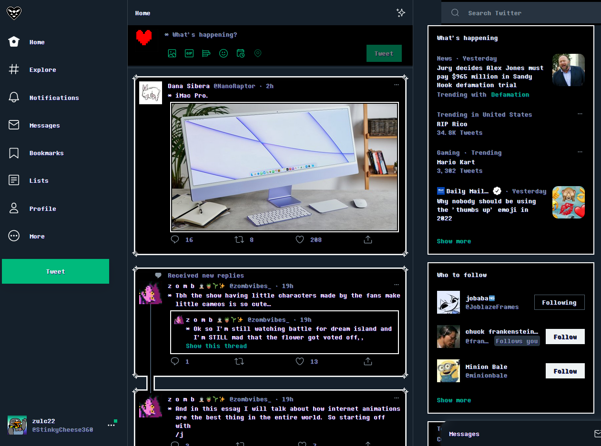

# Twitterune
CSS Userstyle for Twitter, mimicing Deltarune's dialog visuals

To use userCSS themes, you need to have the [Stylus extension installed on your browser](https://github.com/openstyles/stylus#releases).

Install the userCSS [directly from the repo](https://github.com/zulc22/Twitterune/raw/main/twitterune.user.css), or alternatively, there is [a userstyles.world page for this theme](https://userstyles.world/style/6884/twitterune).

Due to CSP (content security policy), the theme's buttons will not work correctly in Chrome, and even in Firefox (the browser I primarily develop it for), you need to manually install ["Determination Mono Web"](https://www.fontspace.com/determination-mono-web-font-f23209) (click the three dots next to 'Regular Style' and download) onto your system.

If anyone knows how to skirt CSP in Chrome for the SVG files, or for fonts, please let me know by making an issue. Otherwise I cannot help you, as it is an _intentional_ browser feature preventing it from working. It's possible a Userscript would be able to work around these issues, but I don't want to threaten the security of the people using this theme by injecting JavaScript into their Twitter pages.
